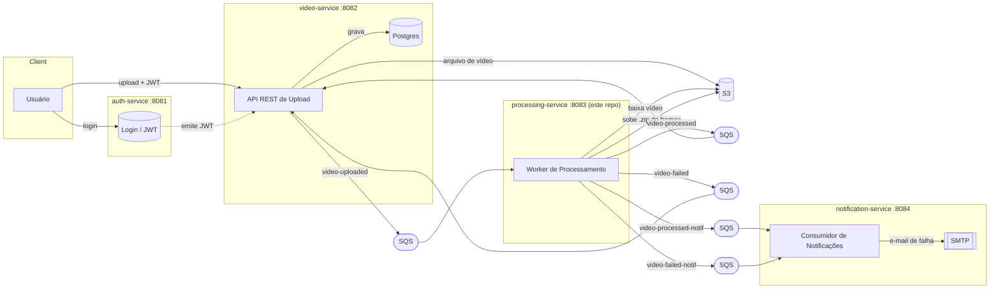
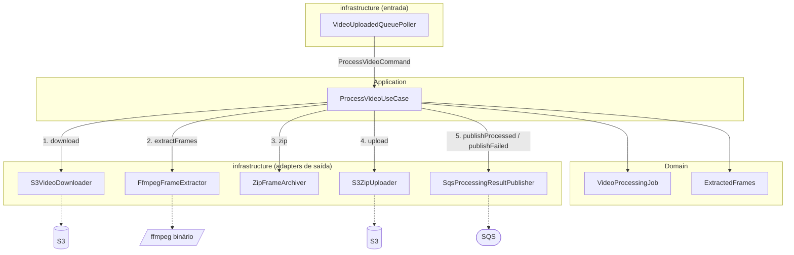
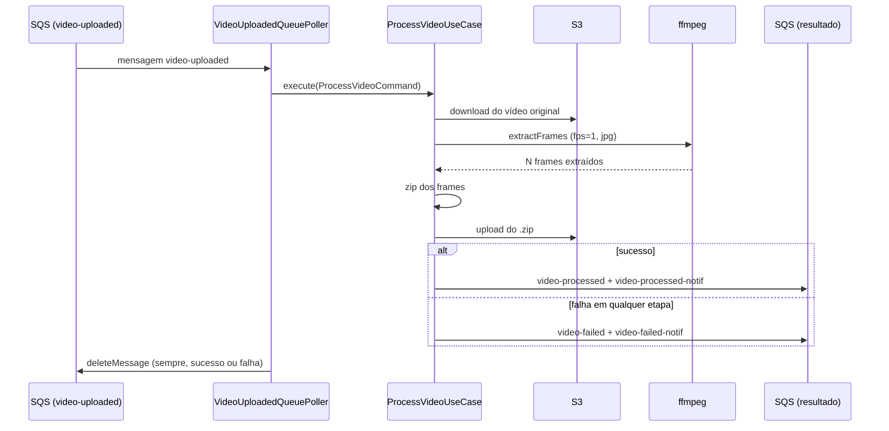
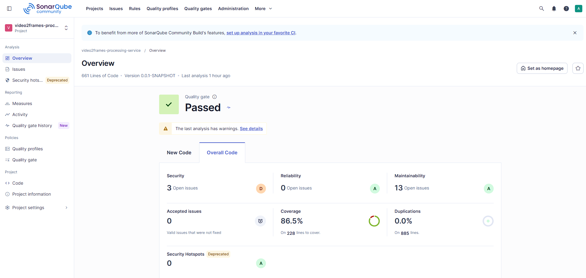

# video2frames-processing-service

Projeto Pós-Tech Fase 05 — microsserviço responsável por **processar vídeos e extrair frames** dentro do sistema Video2Frames.

Este é o "worker" da arquitetura: não expõe nenhuma API REST de negócio (somente endpoints do Actuator). Todo o trabalho é disparado por mensagens SQS. Ele consome eventos de vídeo enviado, baixa o arquivo do S3, extrai frames com **ffmpeg** (via `ProcessBuilder`, chamando um binário real), compacta os frames em um `.zip`, sobe o `.zip` para o S3 e publica o resultado (sucesso ou falha) de volta em filas SQS.

> Requisito de ambiente: este serviço precisa de um binário `ffmpeg` real disponível no `PATH` (ou apontado pela variável `FFMPEG_PATH`). A imagem Docker já instala o ffmpeg; rodar via `./mvnw spring-boot:run` direto no host exige instalá-lo manualmente.

## Papel no pipeline Video2Frames

O Video2Frames é composto por 4 microsserviços independentes, cada um em seu próprio repositório:

| Serviço | Porta | Responsabilidade |
|---|---|---|
| `video2frames-auth-service` | 8081 | Cadastro/login de usuários, emissão e refresh de JWT |
| `video2frames-video-service` | 8082 | API REST de upload de vídeo (protegida por JWT), metadados em Postgres, upload para S3, publica `video-uploaded`, consome `video-processed`/`video-failed` |
| **`video2frames-processing-service`** (este repo) | 8083 | Consome `video-uploaded`, extrai frames com ffmpeg, publica o resultado |
| `video2frames-notification-service` | 8084 | Consome `video-failed-notif` e envia e-mail de falha via SMTP; consome `video-processed-notif` (hoje apenas confirma o recebimento, sem e-mail de sucesso ainda) |



## Arquitetura interna

O serviço segue **arquitetura hexagonal** (ports & adapters), separada em três camadas:

- **domain**: `VideoProcessingJob` (validação do job) e `ExtractedFrames`, além das exceções de domínio (`InvalidProcessingJobException`, `VideoProcessingFailedException`). Não há banco de dados — o "domínio" é o próprio pipeline de transformação.
- **application**: `ProcessVideoUseCase` orquestra o fluxo fim-a-fim através de 5 *ports* (`VideoDownloadPort`, `FrameExtractorPort`, `ArchivePort`, `ZipUploadPort`, `ProcessingResultPublisherPort`).
- **infrastructure**: adapters concretos dos ports — `S3VideoDownloader`, `FfmpegFrameExtractor`, `ZipFrameArchiver`, `S3ZipUploader`, `SqsProcessingResultPublisher` — mais o `VideoUploadedQueuePoller` (entrada, faz *long polling* manual na fila SQS).



Pipeline de processamento de cada vídeo:



Observação de design: diferente dos pollers do `video-service`, aqui a mensagem SQS é sempre deletada após chamar o use case — independente do resultado — porque `ProcessVideoUseCase` nunca relança exceção (captura tudo internamente e publica `video-failed`). Só uma falha do próprio poller (ex.: JSON malformado da mensagem) deixa a mensagem na fila para nova tentativa.

## Filas SQS

| Direção | Fila (nome padrão) | Variável de ambiente | Descrição |
|---|---|---|---|
| Consome | `video-uploaded` | `SQS_VIDEO_UPLOADED_QUEUE` | Disparo do processamento, publicada pelo `video-service` |
| Publica | `video-processed` | `SQS_VIDEO_PROCESSED_QUEUE` | Sucesso — consumida pelo `video-service` para atualizar status |
| Publica | `video-failed` | `SQS_VIDEO_FAILED_QUEUE` | Falha — consumida pelo `video-service` para atualizar status |
| Publica | `video-processed-notif` | `SQS_VIDEO_PROCESSED_NOTIF_QUEUE` | Sucesso — consumida pelo `notification-service` |
| Publica | `video-failed-notif` | `SQS_VIDEO_FAILED_NOTIF_QUEUE` | Falha — consumida pelo `notification-service` para enviar e-mail |

Cada fila tem uma DLQ companion (`<fila>-dlq`, `maxReceiveCount=3`) provisionada em `video2frames-infra-ops` — mensagens que falham repetidamente (ex: JSON malformado) vão parar lá em vez de reprocessar para sempre. Ver [documentação de arquitetura](../video2frames-infra-ops/docs/arquitetura.md#resiliência-das-filas-dead-letter-queue-dlq).

## Stack técnica

- Java 17
- Spring Boot 4.1 (Spring 7)
- AWS SDK v2 (`S3Client`, `SqsClient`) — sem Spring Cloud AWS, poller e publisher manuais
- ffmpeg via `ProcessBuilder` (binário externo, não uma lib Java)
- Lombok (`@Slf4j` para logging)
- Gson (serialização das mensagens SQS)
- JUnit 5 + Mockito + AssertJ (testes)
- Spring Boot Actuator + Micrometer (`micrometer-registry-prometheus`)

## Como rodar localmente

### Opção recomendada: Docker Compose

O LocalStack (S3 + SQS) usado por este serviço é **compartilhado** com `video-service` e `notification-service` — ele mora no repositório irmão `video2frames-infra-ops`, que precisa subir primeiro:

```bash
cd ../video2frames-infra-ops
docker compose up -d
```

Depois, neste repositório:

```bash
docker compose up -d
```

Isso sobe o próprio `processing-service` como container, conectado ao LocalStack compartilhado (`video2frames-localstack:4566`, via a rede Docker externa `video2frames-net`). A imagem Docker já inclui o ffmpeg instalado via `apt-get`, então não é preciso nenhuma configuração extra.

> Se aparecer o erro `network video2frames-net declared as external, but could not be found`, é porque o `video2frames-infra-ops` ainda não foi iniciado — suba-o primeiro.

### Opção alternativa: rodando direto no host

```bash
./mvnw spring-boot:run
```

Nesse caso é necessário:
- Ter o **ffmpeg** instalado e disponível no `PATH` do sistema (ou definir `FFMPEG_PATH` apontando para o binário);
- Ter um endpoint AWS acessível (LocalStack local ou AWS real) configurado via as variáveis de ambiente abaixo.

## Variáveis de ambiente

| Variável | Padrão | Descrição |
|---|---|---|
| `SERVER_PORT` | `8083` | Porta HTTP (usada apenas pelo Actuator) |
| `AWS_REGION` | `us-east-1` | Região AWS |
| `AWS_ENDPOINT_OVERRIDE` | `http://localhost:4566` | Endpoint customizado (LocalStack); vazio/removido para usar AWS real |
| `AWS_ACCESS_KEY_ID` | `test` | Access key (S3/SQS) |
| `AWS_SECRET_ACCESS_KEY` | `test` | Secret key (S3/SQS) |
| `S3_BUCKET` | `video2frames` | Bucket usado para baixar vídeos e subir os `.zip` de frames |
| `SQS_VIDEO_UPLOADED_QUEUE` | `video-uploaded` | Fila consumida |
| `SQS_VIDEO_PROCESSED_QUEUE` | `video-processed` | Fila publicada em caso de sucesso |
| `SQS_VIDEO_FAILED_QUEUE` | `video-failed` | Fila publicada em caso de falha |
| `SQS_VIDEO_PROCESSED_NOTIF_QUEUE` | `video-processed-notif` | Fila de notificação de sucesso |
| `SQS_VIDEO_FAILED_NOTIF_QUEUE` | `video-failed-notif` | Fila de notificação de falha |
| `FFMPEG_PATH` | `ffmpeg` | Caminho do binário ffmpeg |
| `LOG_LEVEL` | `INFO` | Nível de log do pacote `br.com.video2frames` |
| `LOG_LEVEL_ROOT` | `INFO` | Nível de log raiz |
| `LOG_FORMAT` | *(vazio)* | Formato de log estruturado (ver seção Logging) |

## Testes

```bash
./mvnw test
```

Suíte atual: **35 testes** (JUnit 5 + Mockito + AssertJ), nomeados em português no padrão `metodo_quandoX_resultado`, cobrindo os use cases, os adapters de infraestrutura e o modelo de domínio.

**Cobertura atual: 86,5%** (medida via JaCoCo, ver seção de qualidade abaixo).

> Nota: o caminho feliz do `FfmpegFrameExtractor` (extração de frames bem-sucedida) é intencionalmente **não coberto** por teste unitário, pois exigiria um binário ffmpeg real disponível no ambiente de execução dos testes. Os cenários de erro (timeout, exit code != 0, binário ausente) são cobertos com um binário forjado.

## Logging

O serviço usa o **structured logging nativo do Spring Boot 4** (sem dependências extras como Logstash encoder). O formato do console é controlado pela variável `LOG_FORMAT`:

- **Vazio/não definida** (padrão, uso em desenvolvimento): logs em texto simples, legíveis no console.
- **`LOG_FORMAT=ecs`**: logs em JSON no formato [ECS (Elastic Common Schema)](https://www.elastic.co/guide/en/ecs/current/index.html), prontos para ingestão em ferramentas como AWS CloudWatch Logs Insights ou ELK/Elasticsearch — sem nenhuma mudança de código, só a variável de ambiente.

Os adapters de infraestrutura (`S3VideoDownloader`, `S3ZipUploader`, `FfmpegFrameExtractor`, `ZipFrameArchiver`, `SqsProcessingResultPublisher`) e o `ProcessVideoUseCase`/`VideoUploadedQueuePoller` logam os eventos relevantes do pipeline em `INFO` (download/extração/zip/upload/publicação) e erros reais de infraestrutura (ffmpeg falhando, falha de I/O, erro de S3) em `WARN`/`ERROR` com a exceção anexada — diferente de simples falhas de validação de domínio, aqui uma falha de ffmpeg ou disco é uma falha de infraestrutura genuína e merece nível `ERROR`.

## Monitoramento e Observabilidade

Como não há API de negócio, os únicos endpoints HTTP expostos são do **Actuator**:

- `GET /actuator/health` — health check
- `GET /actuator/info` — informações da aplicação
- `GET /actuator/metrics` — métricas via Micrometer
- `GET /actuator/prometheus` — métricas no formato Prometheus

Para visualizar dashboards e métricas ao vivo dos 4 serviços do Video2Frames, use o repositório compartilhado `video2frames-infra-ops`: ele sobe um Prometheus (fazendo *scrape* de `/actuator/prometheus` de todos os serviços via `host.docker.internal`) e um Grafana já provisionado com o dashboard **"Video2Frames - Overview"**.

## Qualidade de código (SonarQube)

Última análise local do SonarQube neste código-base — **Quality Gate: Passed**:

| Métrica | Valor |
|---|---|
| Linhas de código | 661 |
| Cobertura | 86.5% |
| Bugs | 0 (Reliability rating A) |
| Vulnerabilidades | 3 (Security rating D) |
| Code Smells | 13 (Maintainability rating A) |
| Linhas duplicadas | 0.0% |



Para reproduzir a análise localmente (com uma instância do SonarQube rodando em `localhost:9000`):

```bash
./mvnw test org.sonarsource.scanner.maven:sonar-maven-plugin:sonar -Dsonar.projectKey=video2frames-processing-service -Dsonar.host.url=http://localhost:9000 -Dsonar.token=<seu-token> -Dsonar.coverage.jacoco.xmlReportPaths=target/site/jacoco/jacoco.xml
```
